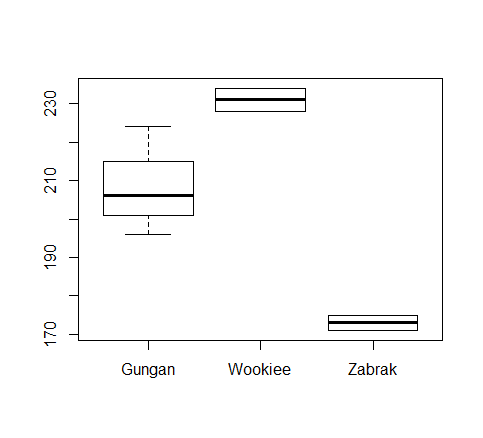

# R Basics / Basic plotting
This sections covers basic plotting of data using scatter plots, histograms and box plots.

## `plot`
The function `plot(...)` creates a simple scatter plot by default.

```r
> library(dplyr)
> data(ToothGrowth)
> ToothGrowth <- filter(ToothGrowth, supp == "OJ")
> dosage <- ToothGrowth$dose
> toothLength <- ToothGrowth$len
> plot(dosage, toothLength)
```

_The Effect of Vitamin C on Tooth Growth in Guinea Pigs_


## `hist`
The function `hist(...)` creates a histogram.

```r
> library(dplyr)
> data(USAccDeaths)
> hist(USAccDeaths)
```

_Accidental Deaths in the US 1973-1978_


## `boxplot`
The function `boxplot(...)` creates a box plot.

```r
> library(dplyr)
> data(starwars)
> starwars <- filter(starwars, species %in% c("Wookiee", "Gungan", "Zabrak"))
> boxplot(height~species, data=starwars)
```

_Box plot comparing height of Star Wars species_

